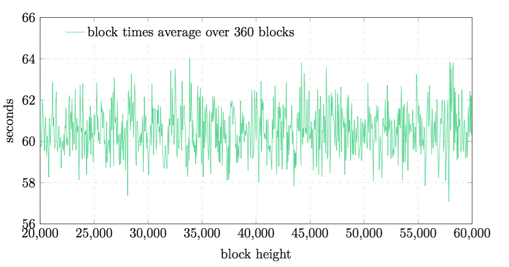

## ブロック作成難度

ブロックの作成難度(difficulty)は直近60ブロックの難度とタイムスタンプから計算されます。60ブロック以下しか存在しない場合はあるだけ考慮に入れます。

#### 図4

メインネットにおける、360ブロックの平均ブロック生成難度。

ブロックが１つしかない場合は作成難度としてあらかじめ定められた初期難度(*initial difficulty*)である$$10^{14}$$を用います。
それ以外の場合は以下のようにして計算されます。

* $$d = \frac{1}{n} \sum^n_{i=1}(difficulty \: of \: block \: i)$$ ... 平均難度
* $$t = \frac{1}{n} \sum^n_{i=1}(time \: to  \: create \: block \: i)$$ ... 平均作成時間
* $$difficulty = d * \frac{60}{t}$$ ... 新規作成難度

前回のブロックに比べて新しい難度に5%以上の増減がある場合、変化率は5%に切り下げられます。

さらに、難度は一定の幅に収まるようになっています。難度が$$10^{15}$$以上か$$10^{13}$$以下の場合は切り上げられるか切り捨てられます。

このアルゴリズムを用いた場合、ブロック生成時間は平均$$60 \: \pm \: 0.5$$秒の範囲に収まることがシミュレーションと$$\beta$$版での実験によって確認されています。

作成難度の最大変化率として5%という遅い値を採用していることで、全体の50%以下の重要度しか持たない攻撃者が隠れてチェーンを作成しても60秒よりもかなり長い時間がかかるため、攻撃を成功させることが難しくなっています。
