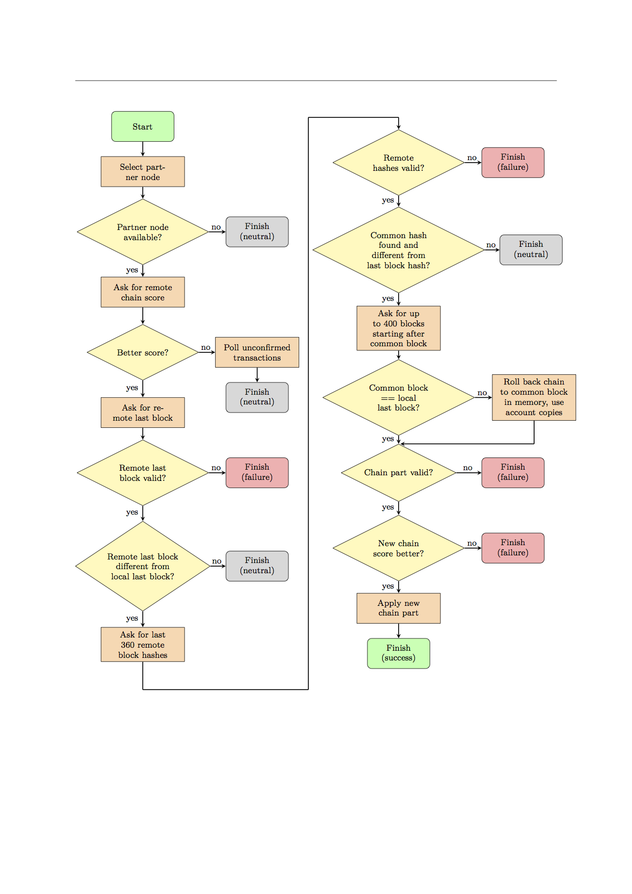

## ブロックチェーンの同期

ブロックにはスコアが割り振られているので、ブロックの集合にもスコアをつけることができます。

$$
score = \sum_{block \in blocks} block \: score
$$

ブロックチェーンの同期はあらゆるブロックチェーンベースの暗号通貨にとって中心的なタスクです。
時々刻々と、ローカルノードはリモートノードにチェーンのことについて問い合わせます。
リモートノードは計算されたトラスト・バリュー（[6章: ノードの評判管理](Reputation/6_Reputation.md)を参照）に基いて選ばれます。

もしリモートノードによって提供されるチェーンのスコアの方が高い場合、2つのノード間で最後に一致するブロックを探し、成功すればそこから最大400ブロックがリモートノードからローカルへ送られます。

そのチェーンが有効なものだった場合、ローカルノードは自身のチェーンをリモートのもので置き換えます。
無効なものだった場合、ローカルノードはそのチェーンを拒否し、リモートノードとの同期には失敗したものとみなします。

このアルゴリズムはフォークの解消にも役立ちます。
最後に一致するブロックとローカルの最終ブロックとの高さの差は最大で360でなくてはならなず、したがってこの同期アルゴリズムで解消されるフォークの長さは最大で360ブロックでなくてはなりません。

以下のフローチャートがこのプロセスをより詳細に図解しています。

### 図5

ブロックチェーン同期プロセスのフローチャート
